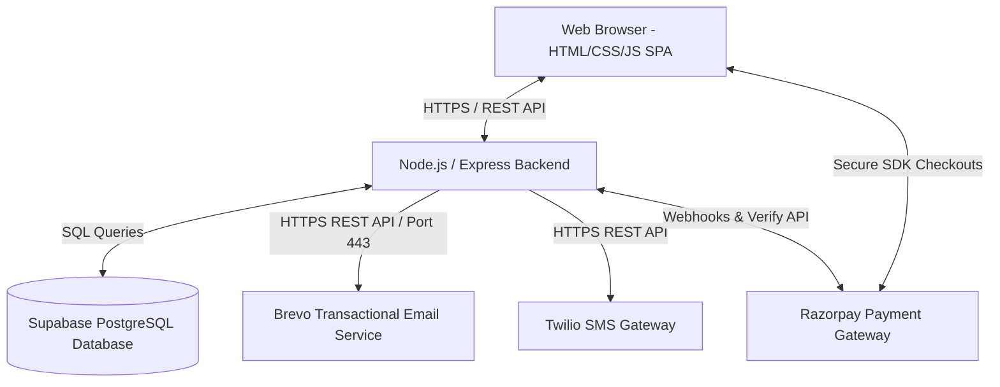

# ChitLite - System Design Document

This document details the high-level system design, database architecture, workflows, and core algorithms of the ChitLite Chit Fund Management Platform.

---

## 1. System Architecture

ChitLite is built on a modern Client-Server Single-Page Application (SPA) architecture:



---

## 2. Database Schema (Entity-Relationship Diagram)

Below is the database structure. Upon app startup, tables are initialized automatically using `db.js`:

```mermaid
erDiagram
    OWNERS {
        VARCHAR id PK
        VARCHAR username UNIQUE
        VARCHAR password_hash
    }
    GROUPS {
        VARCHAR id PK
        VARCHAR name
        DECIMAL value
        DECIMAL commission
        INTEGER duration
        INTEGER current_month
        VARCHAR status
        TIMESTAMP start_date
    }
    MEMBERS {
        VARCHAR id PK
        VARCHAR group_id FK
        VARCHAR client_id
        VARCHAR name
        VARCHAR phone
        VARCHAR email
        TIMESTAMP joined_at
    }
    AUCTIONS {
        VARCHAR id PK
        VARCHAR group_id FK
        VARCHAR winner_member_id FK
        INTEGER month_number
        DECIMAL bid_discount
        DECIMAL dividend_per_member
        DECIMAL commission_value
        DECIMAL amount_won
        DECIMAL net_payable_to_winner
        TIMESTAMP auction_date
    }
    PAYMENTS {
        VARCHAR id PK
        VARCHAR group_id FK
        VARCHAR member_id FK
        INTEGER month_number
        DECIMAL amount_due
        DECIMAL amount_paid
        VARCHAR status
        VARCHAR payment_method
        VARCHAR transaction_id
        VARCHAR remarks
        TIMESTAMP paid_at
        TIMESTAMP created_at
    }
    NOTIFICATIONS {
        VARCHAR id PK
        VARCHAR group_id FK
        VARCHAR member_id FK
        VARCHAR member_name
        VARCHAR type
        VARCHAR recipient
        TEXT message
        VARCHAR status
        TEXT error_message
        TIMESTAMP sent_at
    }
    QUERIES {
        VARCHAR id PK
        VARCHAR member_id FK
        VARCHAR client_id
        VARCHAR member_name
        TEXT question
        TEXT answer
        TIMESTAMP created_at
        TIMESTAMP answered_at
    }

    GROUPS ||--o{ MEMBERS : has
    GROUPS ||--o{ AUCTIONS : contains
    GROUPS ||--o{ PAYMENTS : generates
    MEMBERS ||--o{ PAYMENTS : pays
    MEMBERS ||--o{ AUCTIONS : wins
    MEMBERS ||--o{ QUERIES : submits
    MEMBERS ||--o{ NOTIFICATIONS : receives
```

---

## 3. Core Bidding & Financial Arithmetic

Chit funds are savings-and-credit circles. For a group of size $N$ (equal to duration months), with total group value $V$ (e.g., ₹300,000) and organizer commission rate $C$ (e.g., 5%):

### A. Monthly Auction and Dividend Calculation
In month $M$, members bid a discount $D$ (the amount of money they are willing to give up to get the cash pool immediately).
1. **Organizer Commission**: 
   $$Commission = V \times C$$
2. **Gross Bid Winner Amount (Amount Won)**: 
   $$AmountWon = V - D$$
3. **Dividend Pool**: The discount bid minus the organizer's commission is distributed equally among all members:
   $$TotalDividendPool = D - Commission$$
   $$DividendPerMember = \frac{D - Commission}{N}$$
4. **Member's Monthly Installment Due**:
   Each member pays their share of the total value minus their monthly dividend:
   $$MemberMonthlyDue = \frac{V}{N} - DividendPerMember$$

---

### B. Winner Net Payout Math (with past winner premiums)
Past auction winners must pay an extra premium fee per installment to increase the payout pool for subsequent winners. 

For a member winning in month $M$ where $W_{past}$ is the count of past winners in the group ($M - 1$ past auctions) and $P_{extra}$ is the premium per past winner:
1. **Premium Payout Increase**:
   $$PremiumIncrease = W_{past} \times P_{extra}$$
2. **Installment Payment Adjustment**: The winner's installment payment for their own winning month must be recorded as their actual monthly due ($MemberMonthlyDue$), **not** zero.
3. **Net Winner Payout (Gross Payout minus Dues)**:
   $$GrossWinnerPayout = AmountWon - MemberMonthlyDue - Commission + PremiumIncrease$$
   $$NetWinnerPayout = GrossWinnerPayout - OutstandingDues_{all\_groups}$$

---

### C. Database-Level Backward Dues Deduction (Total Unpaid Dues)
To protect the organizers, when a winner's payout is calculated, the system automatically checks for unpaid dues they have across **all** chit groups they are enrolled in.
1. The backend performs a database transaction.
2. It fetches all unpaid installments where `status = 'unpaid'` for that member.
3. It deducts those outstanding amounts from the winner's gross payout.
4. The status of those bills is updated in the database to `'paid'` with the transaction ID/remarks noting they were cleared via winner payout deduction.
5. The remaining balance is sent to the winner as the **Net Receivable Payout**.

---

## 4. Communication & Notification Flow

ChitLite supports dual notifications (SMS via Twilio, Email via Brevo HTTP API).

```
[Trigger Payment Reminders]
            │
            ▼
┌─────────────────────────┐
│ Fetch Dues from DB      │
└───────────┬─────────────┘
            │
            ▼
┌─────────────────────────┐
│ Loop through members    │
└───────────┬─────────────┘
            ├──────────────────────────┐
            ▼                          ▼
   [SMS Notification]         [Email Notification]
            │                          │
   Is Twilio Configured?       Is Brevo Configured?
       ├── Yes: Send SMS          ├── Yes: HTTP POST to Brevo API
       └── No: Simulate log       └── No: Fallback to local SMTP / log
            │                          │
            └───────────┬──────────────┘
                        │
                        ▼
            ┌──────────────────────┐
            │ Insert notification  │
            │ status/error into DB │
            └──────────────────────┘
```

* **Network Bypass**: Render.com blocks outgoing SMTP ports (25, 465, 587) on the free tier. Switching to Brevo's Web API via HTTPS (Port 443) avoids outbound port blocks completely, enabling reliable production email delivery.
